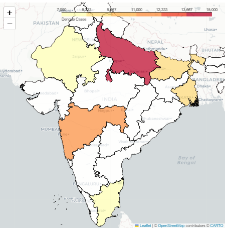

# Project2-EDA
> **Brief Description:** - Display the distribution of dengue cases across different states or regions in India. This visualizes the geographic spread and intensity of outbreaks.

---

## Table of Contents

- [Description](#description)
- [Video Explanation](#video)
- [Technologies Used](#technologies-used)
- [Dataset](#dataset)
- [Program Codes ](#program-codes)
- [Screenshots](#screenshots)
- [Contribution](#contributipn)
- [Contact Details](#contact-details)

---

## Description

Display the distribution of dengue cases across different states or regions in India. This visualizes the geographic spread and intensity of outbreaks.

## Video

## Technologies-used

Python programming language, pandas, folium, IPython and geopandas package.

## Dataset

The dataset has been generated by another program. However, it is recommended that for real life analysis actual data should be collected and processed properly to get realistic results.

## Program-codes

The programs are written on jupiter notebook, You may run the program on Google colab by clicking on the colab badge below.

## Screenshots

## Contribution

The programs are written by Santanu Karmakar

## Contact-details

If you wish to contact me, please leave a message (Preferably WhatsApp) on this number: 6291 894 897.
Please also mention why you are contacting me. Include your name and necessary details.
Thank you for taking an interest.
