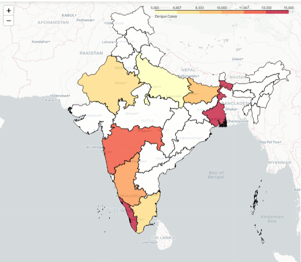

# Project2-EDA
> **Brief Description:** - Display the distribution of dengue cases across different states or regions in India. This visualizes the geographic spread and intensity of outbreaks. This map is known as Choropleth Map,

---

## Table of Contents

- [Description](#description)
- [Video Explanation](#video)
- [Technologies Used](#technologies-used)
- [Dataset](#dataset)
- [Program Codes ](#program-codes)
- [Screenshots](#screenshots)
- [Contribution](#contributipn)
- [Contact Details](#contact-details)

---

## Description

Display the distribution of dengue cases across different states or regions in India. This visualizes the geographic spread and intensity of outbreaks.

## Video
<!--
 
-->

We are working on this section. Please check at some other time.

## Technologies-used

Python programming language, pandas, folium, IPython and geopandas package.

## Dataset

The dataset has been generated by another program. However, it is recommended that for real life analysis actual data should be collected and processed properly to get realistic results.

## Program-codes

The programs are written on jupiter notebook, You may run the program on Google colab by clicking on the colab badge below. However, the output maynot be generated on colab. For that you have to download the program and run it locally. Make sure that the packages are all installed.

## Screenshots

**This program creates an interactive choropleth map to visualize the distribution of dengue cases across different states in India. Here are the key conclusions that can be drawn from this program:**

- **Geographical Distribution of Dengue Cases:**

  - The map will show which states have higher or lower numbers of dengue cases, using a color gradient (e.g., shades of yellow to red) to represent the intensity of the cases.
  
- **State-Level Insights:**

  - By examining the map, one can easily identify which states are most affected by dengue. For example, states with darker shades of red will have more cases compared to those with lighter shades or white (indicating no data).
  
- **Data Completeness:**

  - The program checks for mismatches between the state names in the dengue cases data and the geospatial data, ensuring that the data used for visualization is accurate and complete.
  - If there are any states in the dengue data not found in the geospatial data, or vice versa, these mismatches are identified, which helps in cleaning and verifying the data.
  
- **Visual Clarity:**

  - State borders are added to the map for better visual clarity, making it easier to distinguish between different states and understand the geographical spread.
  
- **Interactive Map Features:**

  - The interactive map allows users to zoom in and out and hover over states to see specific data points, providing a more engaging and detailed exploration of the data.
  
- **Data Merging and Preparation:**

  - The program demonstrates how to merge geospatial data with epidemiological data, ensuring that each state's dengue case data is correctly aligned with its geographical representation.

- **Export and Display:**

  - The map is saved as an HTML file, which can be shared and viewed outside of the notebook environment.
  - The map is also displayed within the notebook, allowing for immediate inspection and interaction.

By using this map, public health officials, researchers, and policymakers can gain valuable insights into the regions most affected by dengue, helping them to allocate resources, plan interventions, and monitor the effectiveness of public health measures.

## Contribution

The programs are written by Santanu Karmakar

## Contact-details

If you wish to contact me, please leave a message (Preferably WhatsApp) on this number: 6291 894 897.
Please also mention why you are contacting me. Include your name and necessary details.
Thank you for taking an interest.
